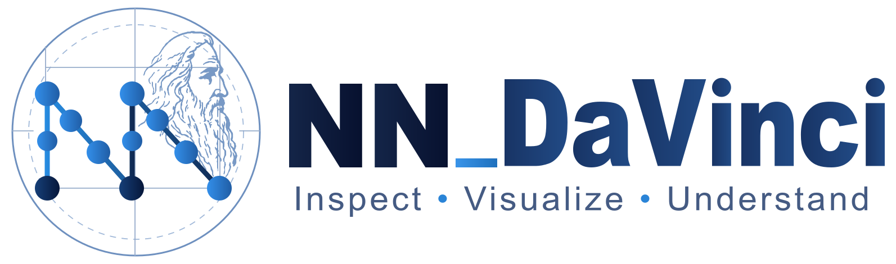

# NN_DaVinci 0.7.3

<p align="center">
  
</p>

**Reader-Visible Scientific Completeness & Generalization Hotfix**

NN_DaVinci is a local-first scientific authoring tool for inspectable neural-network diagrams. Version 0.7.3 preserves the complete 0.7.2 workflow and guarantees that every detected critical architecture role is reader-visible in final paper outputs. A generic evidence-derived role graph drives production Figure/Scene projections, while deterministic metamorphic and landed-output mutation suites block corpus-name shortcuts and metadata-only success.

This development tree is `NN_DaVinci_0.7.3_Dev`. Its frozen parent is authoritative 0.7.2 run `20260901T142604Z-010606e8`: 410 allow-listed source files with digest `6d4591e41fd423604fe3537aba200bcdd57e4254c0684dc6bd5b3672fd9c169e` and 353/353 Python test IDs passing. The parent tree and artifact are read-only baselines and are never used as current 0.7.3 output.

## Evidence-preserving document model

```text
framework/model source
        ↓
Graph IR                 model facts: nodes, ports, tensors, hierarchy, source locators
        ↓
Semantic View            evidence-backed structure, confidence, reasons, two-way mappings
        ├─→ Figure IR 1.0        2D Pages, Panels, Layers, objects, routes and author state
        └─→ Scene IR 1.0         XYZ geometry, cameras, lights, materials, routes and author state
              ├─→ CPU projection → SVG/PDF/TikZ/PPTX/PNG/EPS/offline HTML
              └─→ world export   → Scene JSON/glTF/GLB
```

Graph IR remains the source of model facts. Semantic View aggregates only evidenced structure. Architecture Evidence 1.0 records a family, confidence, reasons, exact supporting node/edge/port IDs, detected roles and repetition counts, protected critical routes, explicit uncertainty, a source digest, and a provenance digest. Display names, model keys, class names, filenames, and requested layouts are excluded from recognition. Figure IR and Scene IR independently land those source-bound roles and routes; a separate parity oracle reads the serialized documents and rejects omissions, relabelling, repeat-count drift, or provenance substitution.

Figure IR and Scene IR store author expression and never write visual size, depth, labels, or inferred architecture back into the model. Materialized derived objects carry the Graph/Semantic/Figure IDs available for their evidence or are explicitly marked `template`, `author_annotation`, `external_3d`, or `unknown`. Very large summary-first Scenes use an explicit digest-and-bounded-representatives provenance mode instead of pretending that every covered source ID is embedded in each visible summary object.

Project schema 1.4 stores both authoring documents. Loading a 1.3 project adds a valid empty Scene IR and migration record only; it does not invent a mesh, tensor shape, architecture, or provenance.

## Start the local application

```bash
cd NN_DaVinci_0.7.3_Dev

PYTHONPATH=src ../envs/python-tools/bin/python \
  -m nn_davinci serve --host 127.0.0.1 --port 8765 --no-browser

# Open http://127.0.0.1:8765
```

The primary workflow is **Import → Explore & Analyze → Compose 2D/3D → Proof & Export**. Graph, Figure, and Scene are explicit workspaces; switching among them preserves their local selection/view context while shared evidence IDs provide cross-workspace highlighting.

The service binds to loopback by default, has no authentication, and is intended for one local user. It is not a public or multi-user server. Model uploads are not sent to a remote service.

## Scene CLI and replay

Create an editable Scene from a Graph/model source and export paper plus world formats:

```bash
PYTHONPATH=src ../envs/python-tools/bin/python -m nn_davinci scene \
  examples/resnet.json \
  --architecture resnet \
  --projection orthographic \
  --format svg,pdf,tikz,pptx,png,eps,html,json,gltf,glb \
  --output outputs/resnet-3d
```

Open one of the seven editable archetypes without claiming model evidence:

```bash
PYTHONPATH=src ../envs/python-tools/bin/python -m nn_davinci scene \
  --template transformer \
  --format svg,json,glb \
  --output outputs/transformer-template
```

Validate and replay an existing Project 1.4 Scene workspace, such as one saved by Scene Studio or emitted by the corpus generator:

```bash
PYTHONPATH=src ../envs/python-tools/bin/python -m nn_davinci reproduce \
  outputs/resnet.scene.nndv.json --output outputs/replayed-scene

PYTHONPATH=src ../envs/python-tools/bin/python -m nn_davinci validate \
  outputs/resnet.scene.nndv.json
```

`nnviz project ... --workspace scene` persists the exact `semantic_view.document` used to generate the Scene, writes Project 1.4, and passes focused create→validate→reproduce command checks. Direct `nnviz scene`, Scene Studio save, validation, and replay use the same contextual Graph/Semantic/Figure/Scene validation boundary. Python factories and pickle checkpoints remain explicit trusted-code opt-ins.

The public package entry points are `scene_from_graph(...)` and `render_scene(...)`. Lower-level module APIs provide `model_scene_from_graph(...)`, `project_scene(...)`, and `export_scene(...)` for callers that need explicit construction, CPU projection, or format dispatch. The loopback API exposes template, Graph-to-Scene, validation, CPU projection, picking, transform, and format-export routes under `/api/scene/`.

Python factories and pickle checkpoints may execute code and remain opt-in trusted inputs (`--allow-code` / `--allow-pickle`). ONNX, Graph IR, safe configuration, Project, and Scene JSON parsing do not execute model code. A `state_dict` remains weights-only and never receives invented topology.

## Why this is genuine 3D

Scene objects have independent X/Y/Z position, Euler rotation in **degrees**, positive three-axis scale, composed world matrices, and world-space bounds. Orthographic and perspective cameras use distinct view/projection matrices. The browser WebGL2 path submits real meshes and actual route segments through the camera matrix with a depth buffer, and places collision-avoiding Scene labels from projected object anchors; it does not substitute an origin placeholder for a route. The CPU path independently projects those same world primitives.

The focused test contract proves that:

- rotating a camera changes projected coordinates without changing object world coordinates;
- orthographic and perspective cameras produce different depth behavior;
- occlusion and hidden-line decisions use projected depth;
- ray picking orders intersected objects by actual world-space distance;
- GLB contains meshes/nodes and non-zero XYZ coordinates, plus cameras, materials, object IDs, and provenance.

The legacy `presentation.perspective_mode` remains only a 2D CSS presentation preference. It is not migrated into Scene IR and is never described as 3D evidence.

## Seven 3D architecture grammars

Editable template and evidence-backed generation are available for CNN, ResNet, U-Net, Transformer, MoE, Multimodal Fusion, and Diffusion U-Net. Templates use template-only provenance. The fixed real-model corpus proves ResNet50 residual stages `[3,4,6,3]`, ViT/BERT attention–FFN–residual structure, U-Net encoder/decoder/skip levels, diffusion conditioning routes with an explicitly unknown external sampling loop, top-k MoE router/expert/combine routes, and separate image/text lanes into fusion. Model-derived scenes use architecture-specific roles only when Graph/Semantic evidence supports them; display names and requested layouts cannot create scientific claims.

Dynamic, symbolic, and unknown tensor dimensions remain symbolic or `?`. Tensor labels retain authoritative shape evidence while geometry records that its thickness/extent is a visual mapping rather than a literal measured tensor dimension. Large Graphs use bounded summary/focus generation; the default Scene generation budget is 250 objects rather than an unbounded mesh expansion.

## Scene Studio and application UX

Scene Studio provides WebGL2 orbit/pan/zoom, named camera views, perspective/orthographic switching, camera lock, ray selection, additive/marquee selection, an on-canvas translate/rotate/scale XYZ gizmo, local/world axes, snapping, grouping/ungrouping, full X/Y/Z alignment and distribution, lock/hide/isolate/focus, exploded/collapsed state, opacity, and depth spacing. Its searchable/filterable tree exposes visibility, locking, group collapse, and selection. Start Center exposes the exact seven editable 3D template families—CNN, ResNet, U-Net, Transformer, MoE, Multimodal Fusion, and Diffusion U-Net—as template-only Scenes. If WebGL2 creation or restoration fails, the app requests a deterministic CPU SVG projection, shows an explicit fallback status, and keeps save/export available.

The inherited shell uses a shared searchable command registry with disabled reasons and shortcuts, responsive contextual overflow, explicit save/action states, resizable persisted sidebars, batch Scene export with progress/failure isolation/cancellation, four complete application themes (Light, Dark, High Contrast, Paper), and three Scene content-density modes (Compact, Paper, Detailed). The Inspector has exactly six collapsible groups—Transform, Geometry, Appearance, Layout, Semantics, and Provenance—with per-property pins and explicit zero/single/multi-selection states. In 0.7.2, initial Scene open computes a camera fit from real world bounds and commits that camera state without mutating object geometry.

Responsive acceptance targets are 1920×1080, 1440×900, 1280×720, 1024×768, 800×600, 568×320, and 390×844. The exact Chrome results and screenshots are release evidence, not assumptions; see the evidence status below.

## Deterministic Scene exports

No paper-vector format is a WebGL screenshot. `scene_projection.py` creates a physical `ProjectedScene` on the CPU with automatic fit-to-content, decorative-frame exclusion, semantic label budgets, external label lanes, collision-aware leader routing, camera matrices, depth sorting, back-face policy, sampled hidden-line removal, vector faces/edges/routes, uniform physical strokes, and a 7 pt label minimum. Hidden-line clipping preserves the final directional arrow segment.

| Format | Contract |
|---|---|
| SVG | native polygons, paths, polylines and text; no raster/foreign object |
| PDF | native vector/text operators; packaged embedded Type0/CID TrueType fonts with ToUnicode maps; no Base-14 fallback or image XObject |
| TikZ | editable vector paths/text; no included screenshot |
| PPTX | editable shapes and text; no flattened slide media |
| PNG | intentional CPU-projected 300-DPI raster proof |
| EPS | EPSF Level 3 vectors; no raster image operator |
| HTML | dependency-free interactive SVG projection with restrictive CSP |
| Scene JSON | canonical, reloadable Scene IR 1.0 |
| glTF/GLB | real XYZ mesh/route geometry, cameras, materials, IDs and provenance |

WebGL is an interactive renderer, not the export authority. Final release acceptance must inspect landed outputs independently; producer metadata cannot waive a measured failure.

## Existing 2D workflow

Scientific Figure Studio remains Figure IR 1.0 with heterogeneous multi-page documents, A–H Panels per Page, Layers/Groups, locks, manual routes, deterministic Unicode/formula handling, physical millimetre/point units, seven publication formats, and a 12-file one-page submission package. Its strict landed-SVG Chrome oracle remains independent of the provisional Python `figure_proof()` estimate.

See [Figure IR](docs/FIGURE_IR.md), [Figure Studio](docs/FIGURE_STUDIO.md), [Scene IR](docs/SCENE_IR.md), [Scene Studio](docs/SCENE_STUDIO.md), and [Architecture](docs/ARCHITECTURE.md).

## Verification state and commands

The authoritative 0.7.3 result comes only from a clean full run and its new `artifacts/v0.7.3/<run_id>/verification.json`. The driver verifies the frozen 0.7.2 tree/artifact, regenerates 14 cases × 10 Scene exports plus the landed Graph/Semantic/Figure/Scene evidence, measures every landed SVG in Chrome, independently checks cross-format role/route completeness and embedded PDF fonts, runs metamorphic and mutation suites, replays all seven browser suites, checks the inherited performance ceiling, builds wheel/sdist, installs both in isolation, exercises service lifecycle, and seals one fresh artifact. This source document does not predeclare that run's outcome; only the artifact-bound report may do so.

```bash
./scripts/verify-quick-0.7.3.sh
./scripts/verify-full-0.7.3.sh   # authoritative only after it completes on a fresh tree/run
```

The 0.7.3 quick gate requires all exact 353 inherited 0.7.2 Python test IDs, zero skip/error/deselection, no regression from the four authoritative parent coverage floors, and additive 0.7.3 tests. A full failure remains a failure until a separate fresh replacement run completes; old artifacts are never relabelled as current results.

## Documentation

- [0.7.3 release notes](docs/RELEASE_NOTES_0.7.3.md)
- [Semantic presentation completeness](docs/SEMANTIC_PRESENTATION_COMPLETENESS_0.7.3.md)
- [Generalization report](docs/GENERALIZATION_REPORT_0.7.3.md)
- [Service lifecycle](docs/SERVICE_LIFECYCLE_0.7.3.md)
- [0.7.2 parent release notes](docs/RELEASE_NOTES_0.7.2.md)
- [0.7.2 feature completion matrix](docs/FEATURE_COMPLETION_MATRIX_0.7.2.md)
- [0.7.2 scientific fidelity report](docs/SCIENTIFIC_FIDELITY_REPORT_0.7.2.md)
- [0.7.2 semantic parity report](docs/SEMANTIC_PARITY_REPORT_0.7.2.md)
- [0.7.2 PDF font report](docs/PDF_FONT_REPORT_0.7.2.md)
- [0.7.1 parent publication visual report](docs/PUBLICATION_VISUAL_REPORT_0.7.1.md)
- [0.7.1 parent UX completion report](docs/UX_COMPLETION_REPORT_0.7.1.md)
- [Requirements](docs/REQUIREMENTS.md)
- [Architecture](docs/ARCHITECTURE.md)
- [Scene IR 1.0](docs/SCENE_IR.md)
- [Scene Studio](docs/SCENE_STUDIO.md)
- [Figure IR 1.0](docs/FIGURE_IR.md)
- [Figure Studio](docs/FIGURE_STUDIO.md)
- [UX design system](docs/UX_DESIGN_SYSTEM.md)
- [Responsive toolbar](docs/RESPONSIVE_TOOLBAR.md)
- [Compatibility](docs/COMPATIBILITY.md)
- [Known limitations](docs/KNOWN_LIMITATIONS.md)
- [Project schema 1.4](docs/PROJECT_SCHEMA_1.4.md)

## Human, repository, and publication boundary

0.7.2 has **0 human participants** and **0 completed human sessions**. First-figure time, paper-ready time, task success, ease/learnability, and serious-semantic-error metrics remain **null / N/A**. Python checks, Chrome E2E, screenshots, AI-assisted inspection, and developer self-tests are machine evidence only.

This work does not initialize or operate Git, and it does not commit, tag, push, upload, publish, or alter the frozen 0.7.1 tree or its authoritative artifact.
